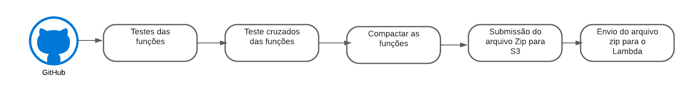
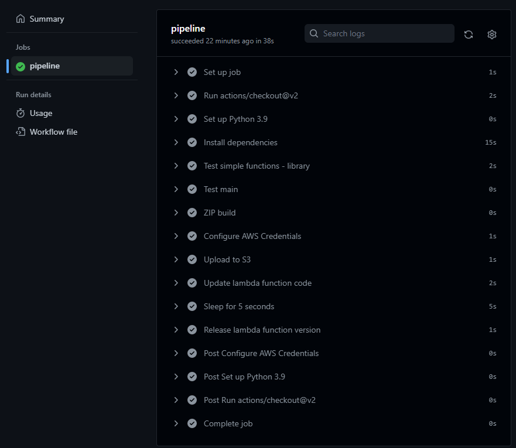
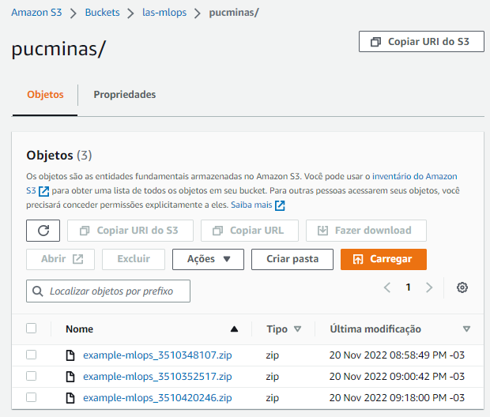
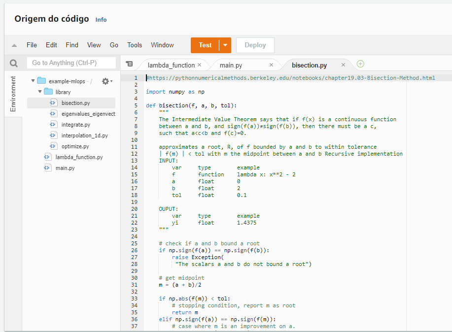

# mlops-pucminas
Este repositório foi criado para a realização de uma das atividades da disciplina de CULTURA E PRÁTICAS DATAOPS E MLOPS do Professor Renan Santos Mendes.


> O objetivo deste repositório foi mostrar uma pipeline CI/CD que automatiza a entrega do serviço com testes, deploy e supostamente envio para a produção. Na parte de CI, realizou-se testes unitários nas bibliotecas e na função principal. Na parte de CD, criou-se uma pasta compactada com os arquivos pertinentes ao funcionamento da aplicação, e.g., excluíndo a parte de testes. Em seguida, realizou-se o envio do arquivo zipado para um datalake da AWS (S3) e o envio para o Lambda (AWS).



## Instalação

### Criando o ambiente virtual
```sh
python -m venv ./venv
venv\Scripts\activate

python.exe -m pip install --upgrade pip
pip install numpy
pip install scipy

pip install pytest

#pip freeze > requirements.txt
```
ou

```sh
pip install -r requirements.txt
```


## Exemplo
### Pipeline:

### S3:

### Lambda:



# Referências
[AWS CLI Command Reference](https://awscli.amazonaws.com/v2/documentation/api/latest/index.html) \
[Python Numerical Methods](https://pythonnumericalmethods.berkeley.edu/notebooks/chapter00.00-Preface.html)